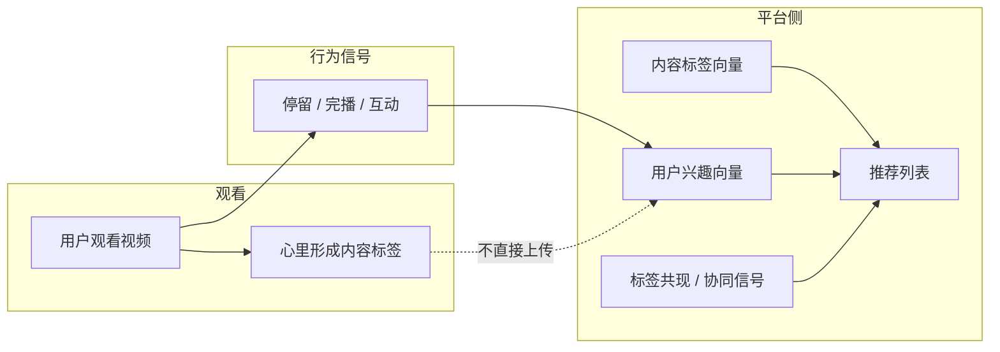

# Season 1 课程理解总结：观看、标签与推荐

**作者：** 慧珍  
**日期：** 2026-08-18  
**所属单元：** S01 — Research Scope and Evidence Workflow  
**文档性质：** 个人课程理解记录（非实证结论）

---

## 1. 核心理解（原始表述）

在观看短视频时，观众会在心里根据内容给视频「打标签」——例如「美妆教程」「职场干货」「情感共鸣」「产品测评」等。平台并不完全依赖用户手动填写这些标签，而是 largely 通过**人们在内容上的停留时间长短**等行为信号，推断哪些标签与哪些用户真正相关，并据此推荐带有相似标签的视频。

进一步地：如果大多数用户对几种标签都表现出共同兴趣，系统会把这些标签视为**共现兴趣簇**。当某一位用户只对其中一种标签表现出明显偏好时，算法会向他推荐**同簇内其他标签**下的内容，从而扩大探索范围、提高停留与互动。

以上是我对本次课程的核心把握。下面是对这一机制的结构化展开，并说明它如何与本项目的研究边界相衔接。

---

## 2. 从「心里打标签」到「可被数据读取的信号」

### 2.1 隐式标签 vs 显式标签

| 类型 | 来源 | 例子 |
|------|------|------|
| **显式标签** | 创作者填写、平台分类、用户手动选择兴趣 | 话题 `#护肤`、分区「美食」、注册时勾选「健身」 |
| **隐式标签** | 从行为中推断 | 完整看完、反复观看、暂停在某段、点赞、收藏、评论、分享、跳过 |

课程强调的关键点是：**观众在观看时的「心里打标签」往往不会写成文字**，但行为会留下痕迹。平台把「停留时间」等行为当作**对某类内容的弱确认**：看得久、看得完、反复看，相当于在心里给该内容贴上了「我感兴趣」的标签；快速划走则相当于「不匹配」。

### 2.2 停留时间为什么重要

在短视频场景里，停留时间（dwell time / watch time）通常是最密集、最可规模采集的信号之一：

- **完播率**：是否看到结尾，反映内容是否 sustained 注意力。
- **有效观看时长**：相对视频总长度的比例，区分「点开即走」与「真正消费」。
- **重复观看**：同一用户对同一条或同类内容的再次停留，强化标签权重。
- **会话内连续观看**：连续刷多条同类视频，说明当前「心理标签」被激活并在延续。

平台并不声称「读心」，而是用统计方式说：*在大量用户身上，某类行为模式与某类内容特征共现*，从而把内容归入标签空间、把用户归入兴趣空间。

---

## 3. 推荐系统如何用标签组织内容

可以把平台的逻辑简化为三层（便于理解，实际工程会更复杂）：

```text
内容层：每条视频 → 一组标签（显式 + 隐式推断）
用户层：每个用户 → 一组兴趣权重（由历史停留等行为更新）
匹配层：把「用户兴趣向量」与「内容标签向量」做相似度排序 → 生成推荐列表
```

### 3.1 基于内容的推荐（Content-based）

若用户长期停留在「平价护肤测评」类视频上，系统会提高「护肤」「测评」「平价」等标签的权重，并优先推送**标签重叠度高**的新视频。这接近「你刚在心里归类的东西，我给你更多同类的」。

### 2.2 基于协同的推荐（Collaborative / Co-interest）

课程中「大多数人对几种标签都有兴趣」描述的是**标签共现**现象：

- 用户 A 对标签 T1、T2、T3 都有高停留；
- 用户 B 目前只对 T1 表现出兴趣；
- 若数据表明「喜欢 T1 的人里，很大比例也高停留 T2、T3」，则向 B 推荐 T2、T3 下的内容。

这不是说 B「一定」喜欢 T2，而是**在群体层面观察到的关联**，用于拓展推荐多样性。常见表述包括：关联规则（「看了 A 的人也看了 B」）、兴趣图谱、embedding 空间里相近的 tag cluster。

### 3.3 一个简化的共现逻辑示意

```text
群体数据：  标签 T1 高兴趣用户中，70% 同时对 T2 高兴趣，55% 对 T3 高兴趣
个体 B：    目前仅对 T1 有稳定高停留
系统动作：  在 T1 相关推荐之外，按共现强度插入 T2、T3 的候选视频
目标：      延长会话、发现新兴趣、提高整体 watch time
```

---

## 4. 与营销分析的关系：标签不只是分类，更是「注意力合约」

从营销视角，标签连接了三件事：

1. **内容承诺**：这条视频声称解决什么问题、唤起什么情绪（hook、价值主张、CTA）。
2. **受众自我识别**：用户是否在心里说「这说的是我」——停留时间是最直接的反馈。
3. **平台分发**：标签与共现结构决定内容被谁看到、与谁的内容并排竞争。

因此，课程中的机制可以转写为一句研究语言：

> 公开 engagement 信号（如点赞、评论）与私人观看行为（停留、是否继续看同类）共同塑造「内容—标签—受众」的匹配；平台推荐则是这种匹配在算法层的放大。

这与本项目 `AuthoritativePlan.md` 中的第一个研究问题方向一致：哪些话题、钩子与叙事结构，与**公众互动**或**单一观看者（Lucy）的持续观看与记忆**相关联——此处「持续观看」正是课程里「停留时间推断兴趣标签」在个人研究尺度上的对应物。

---

## 5. 本项目（Season 1）如何承接这一理解

S01 的任务是冻结研究范围与证据工作流，而非复现平台算法。Season 1 总结与项目设计的对应关系如下：

| 课程概念 | 本项目中的对应 / 边界 |
|----------|------------------------|
| 用户心里打标签 | Lucy 对 30 条 Gold 视频做**人工营销标签**（显式、可审计） |
| 停留时间推断兴趣 | Lucy 的 **1–5 分观看反应评分** + 是否继续看同类（S06 及之后） |
| 平台隐式标签 | **不假设**我们能拿到平台内部模型；只分析公开可见信号与人工标注 |
| 多标签共现推荐 | 后续可做**标签共现 / 分组分析**（S11–S13），但是探索性关联，非因果 |
| AI 辅助打标签 | 人工标签 vs AI 建议的**一致性检验**（S15），对应「机器标签是否可靠」 |

**重要边界（S01 必须可见）：**

- 30 条视频是**深度标注的探索样本**，不能代表全体年轻用户。
- 关联不等于因果：高停留不能证明「某营销手法必然有效」。
- 单一观看者（Lucy）的反应与平台「大多数人」的共现模式**不可直接等同**；本项目做的是 bounded、可复现的个案研究 + 公开信号对照。

---

## 6. 机制流程图（个人理解版）



虚线表示：心理标签不直接入库，平台主要通过可观测行为更新用户模型。

---

## 7. 仍待 Season 2 及之后验证的问题

以下是从本理解中自然延伸、但尚未用本项目数据回答的问题：

1. **哪些营销标签**（hook 类型、价值主张、CTA）与 Lucy 的高停留 / 高记忆一致？
2. 公开互动（点赞、评论量）与私人观看反应是否**同向**？在哪些内容类型上分离？
3. 人工标签与 AI 建议标签，在哪些场景下**一致 / 分歧**？
4. 若存在「多标签共兴趣」结构，在本 30 条样本里是**观察到的模式**还是**样本量不足以稳定估计**？

这些问题已写入项目五个 baseline research questions；Season 1 仅完成概念框架与证据路径的冻结，**不在此文档中给出数值结论**。

---

## 8. 一句话总结

**观看时心里的分类，会通过停留等行为被平台「翻译」成兴趣标签；当多种标签在人群中经常一起出现时，推荐系统会把其中一种标签上的用户，引向其他共现标签的内容——这是注意力数据驱动的匹配与放大，而非简单的「读心」。** 本项目用可审计的人工标注与 bounded 的观看反应，在 30 条 Gold 视频上探索同一逻辑在营销内容分析中的可研究版本。

---

## 9. 证据与修订记录

| 版本 | 日期 | 说明 |
|------|------|------|
| v1.0 | 2026-08-18 | 初稿：基于课程口述理解整理，连接 S01 研究边界 |

**后续修订原则：** 若 pilot（S02–S03）或 Gold 标注（S06）产生与本文冲突的观察，在本文件追加「修订说明」而非 silent overwrite。
